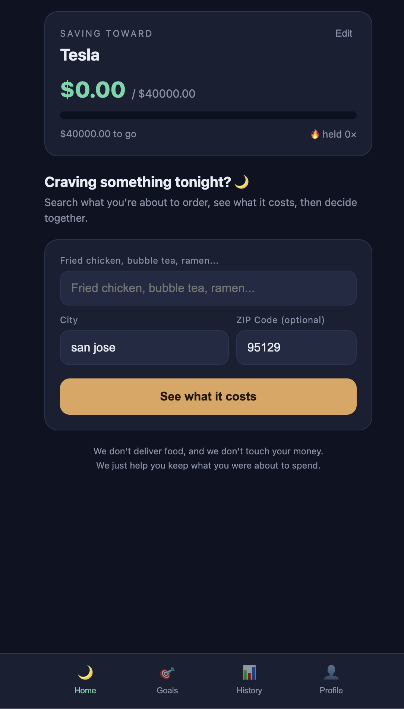
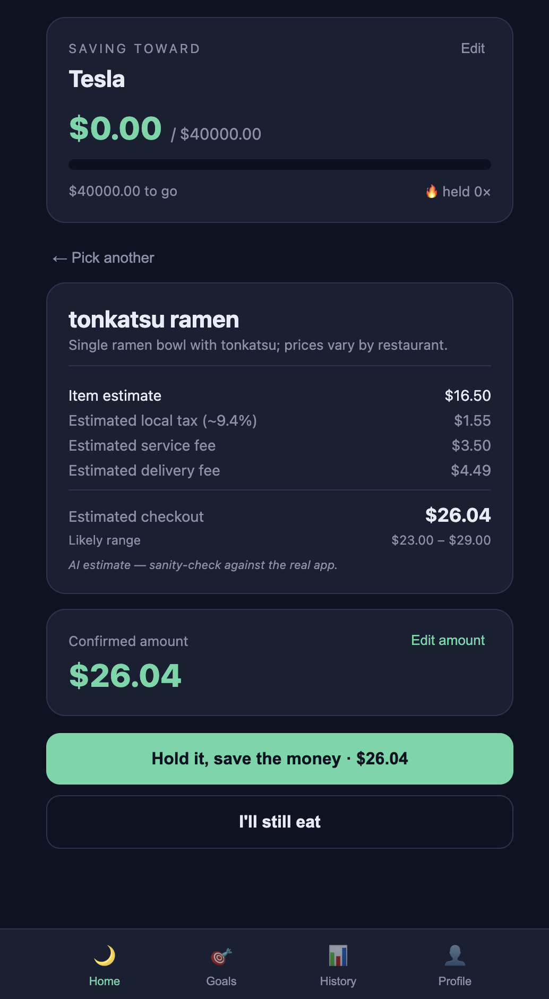
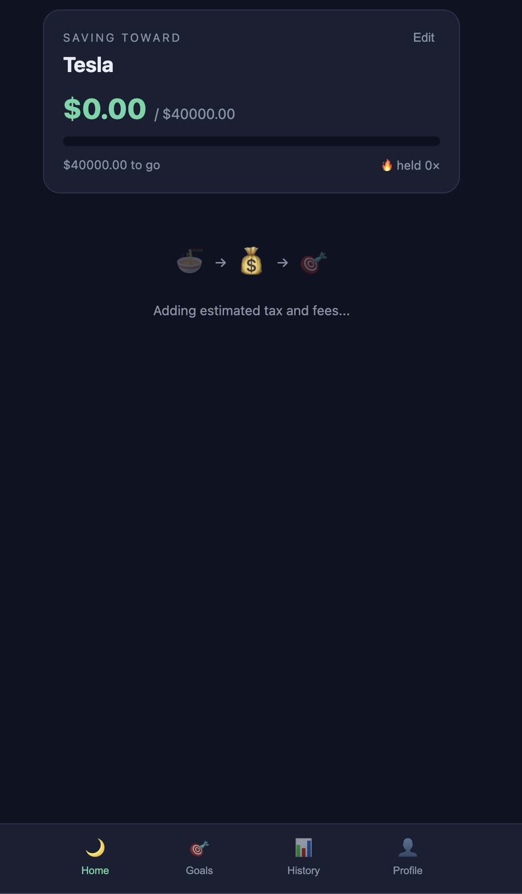
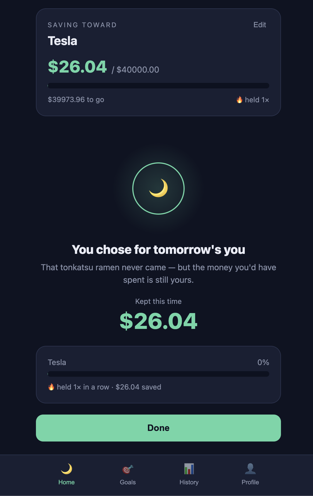

# NightSave

**NightSave** is a multilingual decision-support app that helps you pause before ordering food delivery, see what the order will actually cost, and put the money you don't spend toward a personal savings goal.

**Live Demo:** https://nightsave.vercel.app

NightSave does not process payments, move money, or hold funds on your behalf. It only estimates what an order would cost and lets you log a decision to **Save** or **Eat**, tracking the amount against a goal you set yourself.

## Problem and Solution

Food delivery purchases are often impulsive, made late at night without a clear sense of what the order will actually cost.

NightSave introduces a short pause before checkout. It estimates the likely local checkout price of the order, and asks you to choose: **Save** the money toward a goal, or **Eat** and go ahead with the order. Every "Save" decision moves you closer to a goal you've defined for yourself, turning a moment of impulse into a small, trackable win.

## NightSave v0.2 Features

Only features that exist in the current codebase are listed here.

- Single-item and multi-item order recognition (e.g. "popcorn chicken, milk tea, ramen" is understood as three separate items, each with its own quantity and price)
- Local price estimates in USD, based on the food description, city, and ZIP code
- Itemized subtotal with estimated tax, service fee, and delivery fee
- Editable confirmed amount before making a decision
- Save or Eat decision flow
- Personal savings goals with progress tracking
- One-time goal-completion celebration
- Decision history grouped by local date
- Guest mode (no account required) and Supabase-backed accounts
- Guest-data migration support when a guest signs up, local goals and decisions are migrated to their new account
- Six-language interface: English, Spanish, Japanese, Korean, Simplified Chinese, and Traditional Chinese
- Estimate caching (repeat requests for the same order reuse a recent estimate instead of re-querying)
- Request limits and input validation on order text length and item count
- Duplicate-request protection against accidental repeat submissions
- A dedicated loading experience for longer estimate requests
- Client-side and server-side timeout protection on the estimate request
- Responsive interface

## Tech Stack

- Next.js
- React
- JavaScript
- Supabase
- PostgreSQL
- Vercel
- MiniMax M3 / LLM API

## Architecture Overview

- Browser interface (Next.js / React)
- Next.js API route that receives estimate requests
- Server-side LLM request (API key stays server-side only)
- Server-side validation and total calculation (item limits, subtotal, tax, and fees)
- Supabase-backed estimate cache
- Supabase tables for profiles, goals, and decisions
- Guest localStorage repository for users without an account

No API keys, Supabase keys, or other secrets are included in this repository or this README.

## Screenshots

### Home



### Price Estimate



### Decision Flow



### Saved Result



## Local Development

```bash
npm install
npm run dev
```

Required environment variables (names only, see `.env.example` for the file to fill in locally; no values are included here):

```text
NEXT_PUBLIC_SUPABASE_URL
NEXT_PUBLIC_SUPABASE_ANON_KEY
SUPABASE_SERVICE_ROLE_KEY
LLM_BASE_URL
LLM_MODEL
LLM_API_KEY
```

- `NEXT_PUBLIC_SUPABASE_URL` and `NEXT_PUBLIC_SUPABASE_ANON_KEY` are safe to expose to the browser.
- `SUPABASE_SERVICE_ROLE_KEY` and `LLM_API_KEY` must only ever be used server-side.
- Never prefix a server-only secret with `NEXT_PUBLIC_`.

## Deployment

NightSave is deployed on Vercel.

1. Push this repository to GitHub.
2. Import the repository into Vercel.
3. In the Vercel project's Settings → Environment Variables, set all of the variables listed above.
4. Deploy.

All required environment variables must be set in the Production environment for the app to function correctly.

## Project Status

```text
NightSave v0.2 — functional personal product project
```

Future improvements may be made, but no feature listed above is unfinished or planned only.

## Disclaimer

- Price estimates may differ from actual restaurant or delivery-platform prices.
- NightSave does not process payments or transfer money.
- NightSave is a behavioral decision-support tool and does not provide financial advice.

## Author

David Chen
Management Information Systems student at San José State University

---

## Project Evolution

NightSave was built from scratch and developed through multiple iterations. The archived v0.1 documentation below shows the project's original concept, scope, architecture, and early implementation before it evolved into the current v0.2 product.

This section is preserved to demonstrate the project's development process, technical learning, and product improvements over time.

## NightSave v0.1 — Original Project Documentation

*The following is the original v0.1 README, translated from Chinese into English and archived here for reference. It describes NightSave exactly as it existed at v0.1, before the v0.2 rewrite, and does not include any v0.2 features.*

An interceptor for late-night delivery cravings. It walks you through a fake checkout flow, the food never actually arrives, and instead it tells you how much you saved, then pushes that amount toward a goal you've set.

### Architecture Highlights

The frontend only talks to its own backend. The pricing API key is hidden on the server side (`app/api/estimate/route.js`); the frontend never has access to it, and no one can see it by inspecting the page. Switching providers only requires changing an environment variable, not the code.

- `app/page.jsx` — the interface; progress is stored on the user's device via localStorage
- `app/api/estimate/route.js` — the backend proxy, the only place that touches the API key
- When no provider is configured, a local estimate fallback is used, so the app can be deployed before an AI provider is connected

### Running Locally

```bash
npm install
npm run dev
```

Open http://localhost:3000

### Connecting to MiniMax (or any OpenAI-compatible provider)

1. Copy `.env.example` to `.env.local`
2. Fill in the three values `LLM_BASE_URL`, `LLM_MODEL`, and `LLM_API_KEY`
3. Restart with `npm run dev`

For MiniMax's base URL and model string, always check its official documentation at the time, since the exact values and paths may change. If you are concerned about data flowing through China, use a Western-hosted path such as OpenRouter instead.

### Deploying to Vercel

1. Push this folder to GitHub
2. Import this repo into Vercel
3. In the Vercel project's Settings → Environment Variables, fill in the three `LLM_` variables
4. Deploy

Keep the API key only in Vercel's environment variables. Never write it into the code or push it to GitHub.
